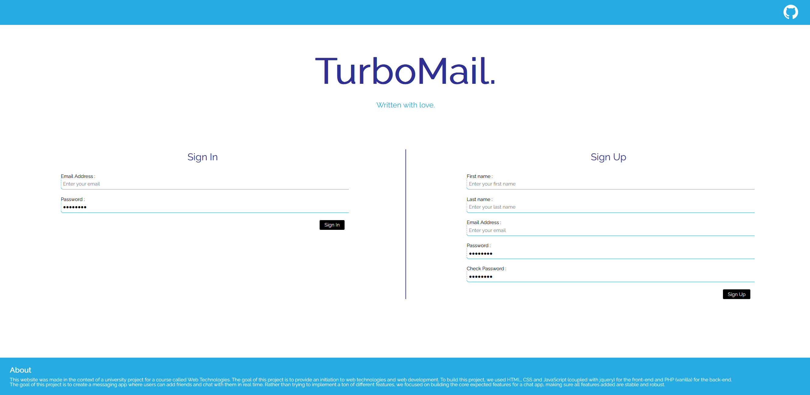

# TurboMail

<!--toc:start-->

- [Website](#Website)
- [Technologies](#technologies)
- [Useful Web development related documentation](#useful-web-development-related-documentation)
- [Try TurboMail](#try-turbomail)
  <!--toc:end-->

TurboMail is a school project conducted by Sam Barthazon and Raphaël Weis. This was
our first attempt at web development, hence the fairly basic project.

## Website

TurboMail is a classic messaging app where its users can send friend requests and chat
with each other. The message updates are not automatic, and the press of a refresh button
is required to fetch new messages. Additionally, the website is fully responsive and should
work without issues on any mobile device.

Here's a screenshot of the login page:


## Technologies

We are using Apache Web Server for our server, along with MariaDB for
the database. We use PHP for our backend, and javascript, HTML and CSS for our
frontend.
You get it, it's the XAMPP stack.

> Note: Aside from Jquery for the frontend, no frameworks were used for this project.

## Useful Web development related documentation

see [useful-links](/doc/useful-links.md)

## Try TurboMail

We currently do not plan to upload this project to the web, but you may try the
application by doing the following :

1. Make sure you have XAMPP, npm and composer installed - all available on Linux, Windows and macOS
2. clone this repository in the htdocs folder (location may vary depending on the OS you're using):

   > You can get the latest commits, if any, by switching to the dev branch

    ```
    git clone https://github.com/raphaelweis/TurboMail.git
    ```

3. Navigate to the cloned TurboMail folder, and, in the project root, run:
   ```
   composer install
   npm install
   ```

4. start xampp, through the command line or the GUI

    ```
    xampp start
    ```

5. Go to http://localhost/phpmyadmin and import the file [TurboMailDB.sql](/database/TurboMailDB.sql).

    > An example database will automatically be created, containing sample data. You can peek at the
    already registered users by looking into the user table in the database.
    The password for all users in "Password"

6. You can now go to http://localhost/TurboMail and browse the application.

**If you encounter any problems during this process, please open a github issue.**

# License

You are free to reuse any part of this project, as stated in the
[LICENSE](LICENSE).
