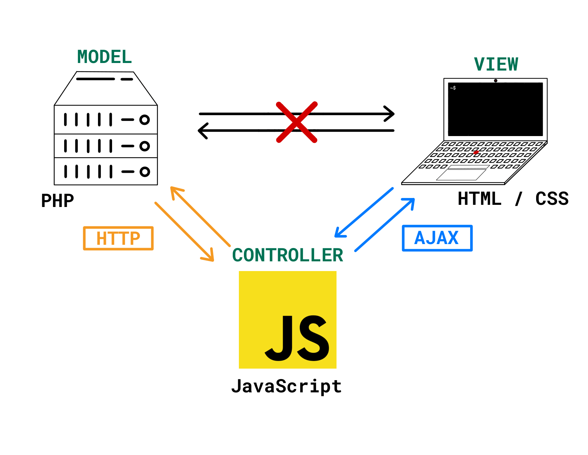

# TurboMail

<!--toc:start-->

- [Vision](#vision)
- [Technologies](#technologies)
- [Useful Web development related documentation](#useful-web-development-related-documentation)
- [Try TurboMail](#try-turbomail)
  <!--toc:end-->

TurboMail is a school project conducted by Sam Barthazon and Raphaël Weis.
We are taking our first course on web development, and are hoping to build
our first fully functionnal Web Application with this project.

## Vision

Our goal is to make an application that allows it's users to send messages to each other,
letting them choose to make the conversation public or private. Public messages can be browsed
on the user's wall (like an instagram feed for example), and can be replied to by anyone.
If we find the time, we would also like to turn the application into an email client, allowing it's
users to check and send emails from their existing email addresses, kind of like thunderbird.

## Technologies

We are currently using Apache Web Server for our server, along with MySQL for the database.
We use PHP for our backend, and javascript, HTML and CSS for our frontend.

> Note : We do not plan to use any kind of frameworks for this project

We are trying to implement the MVC design pattern to better organize our code, here is
a simple sketch to provide an overview of the tech stack :


## Useful Web development related documentation

see [useful-links](/doc/useful-links.md)

## Try TurboMail

We currently do not plan to upload this project to the web, but you may
try the application by doing the following :

1. Make sure you have XAMPP installed - available on Linux, Windows and MacOS
2. clone this repository :

> You can get the latest commits by switching to the dev branch

```
git clone https://github.com/raphaelweis/TurboMail.git
```

2. start xampp server, and ensure that you set it up to watch the cloned repository.
   [more info here](https://wiki.archlinux.org/title/XAMPP)

> Make sure to use the 'TurboMail' alias if you want to use the link below

```
xampp start
```

3. You can now go to [this link](http://localhost/TurboMail/src/html) and browse the application.

You are free to reuse any part of this project, as stated in the [LICENSE](LICENSE).
